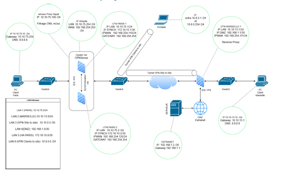

# 🛡️ Hackathon BAI 2026 – Sécurisation d'Infrastructure Réseau

## 📋 Présentation du projet
Ce projet a été réalisé en mai 2026 dans le cadre de ma formation à l'IPSSI pour le projet "Agence OnStream" (Mesure d'audience publicitaire). L'objectif de la mission était de concevoir, chiffrer et sécuriser une infrastructure réseau critique de bout en bout afin de garantir la confidentialité des données et une continuité de service maximale, suivi d'une soutenance devant un jury de professionnels.

## 🖼️ Architecture & Topologie Réseau

## 🏗️ Technologies déployées & Périmètre technique
* **Firewalling & Haute Disponibilité :** Cluster de pare-feux **OPNSense** redondants avec basculement automatique via le protocole **CARP**.
* **Interconnexions sécurisées :** Tunnel VPN Inter-sites **IPSec** pour protéger les échanges et accès nomades **OpenVPN**.
* **Sécurité Offensive & Cybersécurité :** Système de détection et de prévention d'intrusions (IDS/IPS) **Suricata**, intégration de **CrowdSec** et blocage géographique actif (GeoIP).
* **Contrôle des flux :** Proxy transparent **Squid** avec filtrage catégoriel et gestion des logs conforme aux exigences de la CNIL et aux directives NIS2.
* **Disponibilité Web :** Isolation des serveurs en zone **DMZ** derrière un reverse proxy **HAProxy**.

## 📁 Livrables du projet
* 📄 **[Consulter le Dossier d'Architecture Technique (PDF)](./Projet_Groupe25%20(1).pdf)** — *Document complet de 64 pages détaillant les configurations, le plan d'adressage IP et les procédures de montage.*
* 📊 **[Voir le Support de Présentation / Soutenance (PDF)](./HACKATHON%20(3).pdf)** — *Slides de présentation de l'architecture et de la proposition financière.*
