# Laboratoire d'Infrastructure Réseau Virtualisée 🌐
## Projet Personnel d'Acquisition de Compétences

## 📝 Présentation du Projet
Dans le cadre de ma montée en compétences en administration systèmes et réseaux, j'ai réalisé de bout en bout un laboratoire d'infrastructure réseau d'entreprise entièrement virtualisé. 

L'objectif de ce projet était de concevoir un environnement de test sécurisé et autonome (Sandbox) pour appréhender le déploiement d'un contrôleur de domaine, l'automatisation de la gestion des utilisateurs, la distribution dynamique de configurations réseau et l'application de politiques de sécurité centralisées.

### 🛠️ Technologies & Outils Utilisés
* **Hyperviseur :** Microsoft Hyper-V (Génération 2)
* **Système Serveur :** Windows Server 2022 Standard (Expérience de bureau)
* **Système Client :** Windows 10 Professionnel
* **Langages & Protocoles :** PowerShell, Active Directory (AD DS), DNS, DHCP, GPO

### 📐 Architecture Réseau du Laboratoire
Pour isoler mon laboratoire et éviter toute perturbation sur mon réseau domestique (physique), j'ai configuré un commutateur virtuel interne dédié.

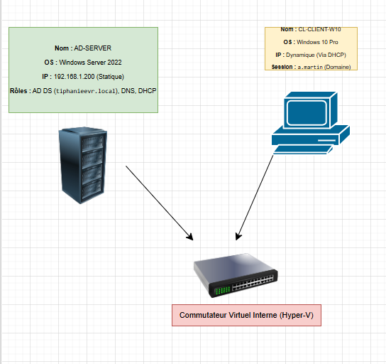

---

## 💻 Étape 1 : Préparation de l'Environnement et du Serveur

La première phase a consisté à dimensionner la machine virtuelle pour le serveur d'infrastructure (`AD-SERVER`) en suivant les bonnes pratiques (Génération 2 pour le support de l'UEFI et de la sécurité renforcée).

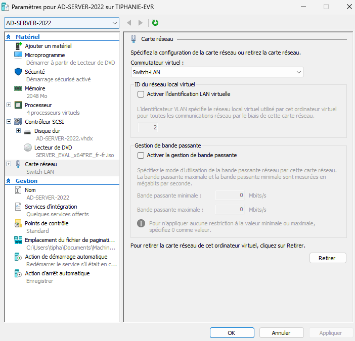
*Dimensionnement des ressources de la machine virtuelle serveur.*

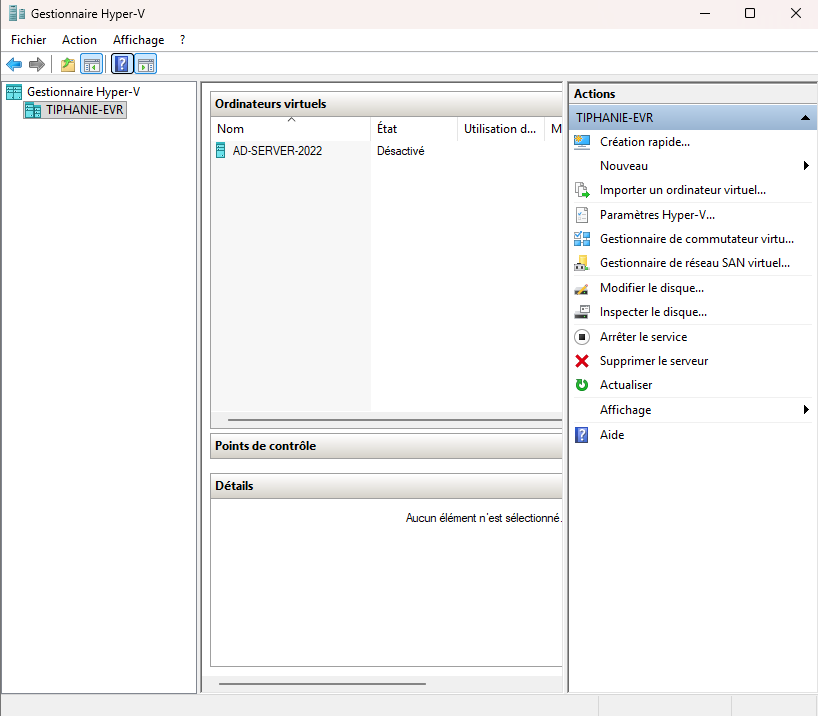
*Vue d'ensemble de l'environnement virtuel initial.*

### Installation du Système et Configuration Réseau
Après l'installation de Windows Server 2022, la première action indispensable pour un serveur d'infrastructure est l'attribution d'une **adresse IP statique fixe** afin de garantir la joignabilité des services DNS et Active Directory.

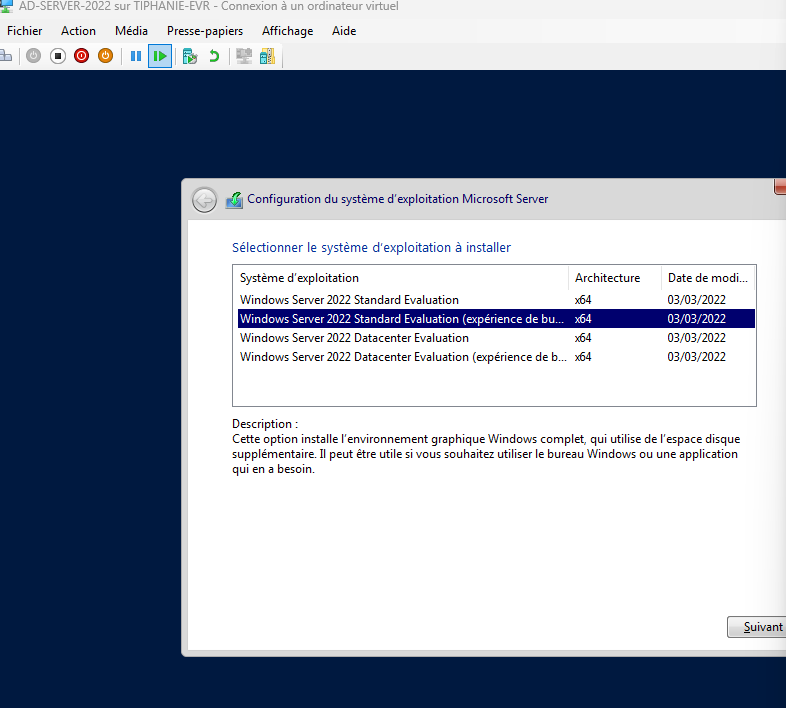
*Installation de Windows Server 2022 Standard.*

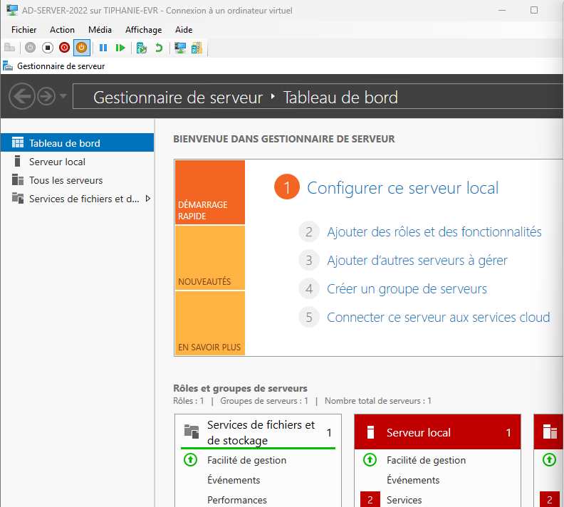
*Tableau de bord du serveur avant le déploiement des rôles.*

L'adresse IP fixe choisie pour le serveur est `192.168.1.200` avec lui-même comme serveur DNS principal (`127.0.0.1`).

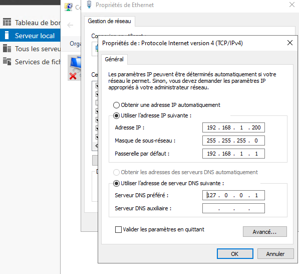
*Configuration de la carte réseau en IP statique.*

---

## 🗂️ Étape 2 : Déploiement d'Active Directory (AD DS) & DNS

Une fois le réseau configuré, j'ai installé le rôle **AD DS** (Services de domaine Active Directory) et promu le serveur comme premier Contrôleur de Domaine d'une nouvelle forêt nommée `tiphanieevr.local`.

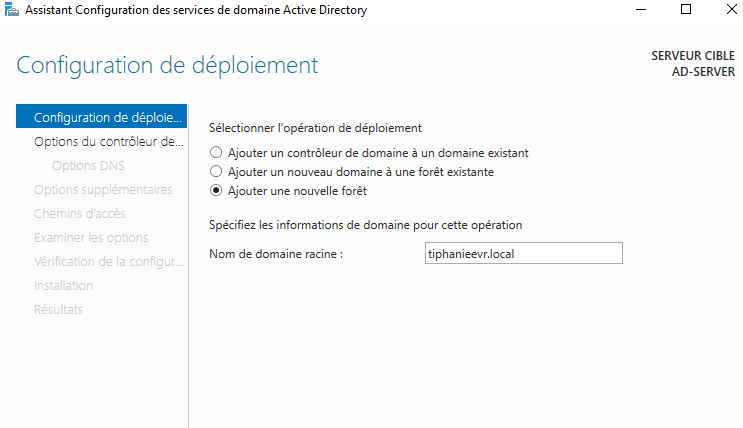
*Configuration et création du domaine tiphanieevr.local.*

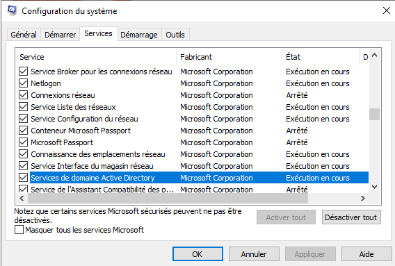
*Vérification réussie des prérequis de sécurité avant l'installation.*

Le rôle **DNS** a été installé automatiquement pour assurer la résolution de noms au sein du domaine, indispensable au bon fonctionnement d'Active Directory.

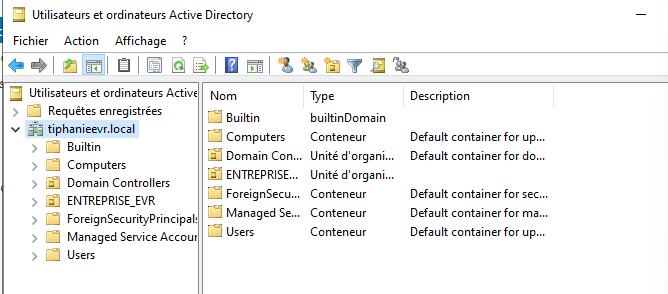
*Ouverture initiale de l'annuaire d'entreprise.*

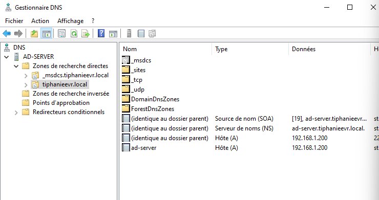
*Vérification de la zone de recherche directe DNS.*

---

## 🚀 Étape 3 : Structuration de l'Annuaire et Industrialisation (PowerShell)

Pour refléter l'organisation d'une entreprise, j'ai créé une arborescence d'Unités d'Organisation (OU). J'ai mis en place une OU parente `ENTREPRISE` contenant une sous-OU `Direction`.

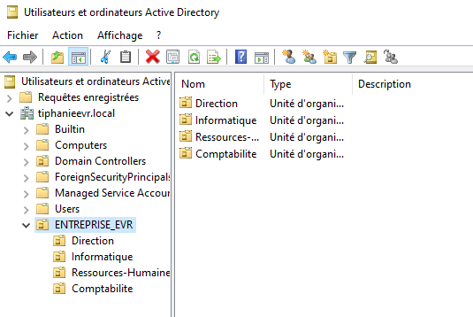
*Arborescence des Unités d'Organisation (OU) dans Active Directory.*

### ⚡ Automatisation en ligne de commande
Plutôt que de créer manuellement des dizaines d'utilisateurs (tâche chronophage et source d'erreurs), j'ai développé et exécuté un script **PowerShell** pour automatiser l'intégration des collaborateurs (`j.dupond`, `a.martin`) dans leurs OU respectives, avec application d'une stratégie de mot de passe sécurisé à la première connexion.

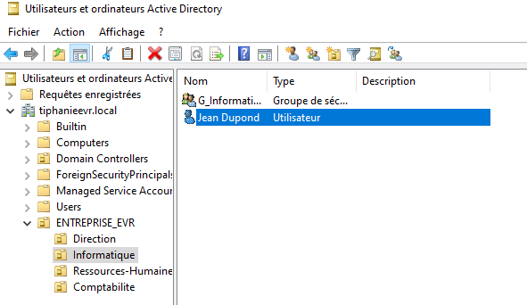
*Premiers tests de création de comptes de l'annuaire.*

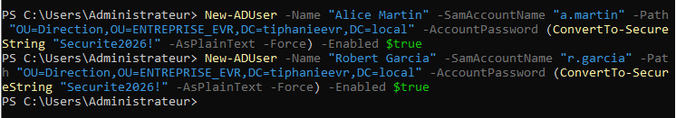
*Exécution du script PowerShell pour la création automatisée et massive des comptes utilisateurs.*

---

## ⚡ Étape 4 : Automatisation Réseau via le Serveur DHCP

Pour automatiser la configuration réseau des futurs postes clients, j'ai installé et configuré le rôle **Serveur DHCP**. J'ai défini une étendue distribuant dynamiquement les adresses IP sur la plage `192.168.1.50` à `192.168.1.150`, tout en transmettant automatiquement l'adresse de la passerelle et du serveur DNS (`192.168.1.200`).

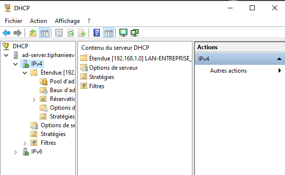
*Configuration de la plage d'adresses et des options d'étendue DHCP.*

---

## 💻 Étape 5 : Intégration, Test du Client (Windows 10 Pro) et GPO

Pour valider l'infrastructure, j'ai déployé une machine virtuelle cliente sous **Windows 10 Professionnel**. 

### 1. Validation du DHCP
Dès son démarrage sur le même commutateur virtuel, la machine cliente a sollicité le réseau et le serveur DHCP lui a attribué une configuration correcte.

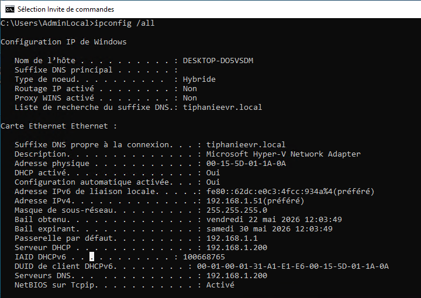
*Résultat de la commande `ipconfig /all` sur le client, confirmant la bonne réception de l'IP via le DHCP.*

### 2. Jonction au Domaine
J'ai ensuite modifié les paramètres système du client pour l'unir au domaine `tiphanieevr.local` en fournissant les identifiants de l'administrateur du domaine.

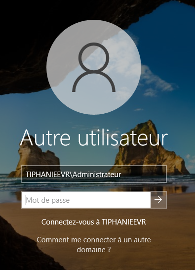
*Écran de connexion Windows 10 synchronisé sur l'annuaire du domaine.*

### 3. Test des Sessions Utilisateurs
J'ai testé avec succès l'ouverture de session de deux profils différents créés par le script.

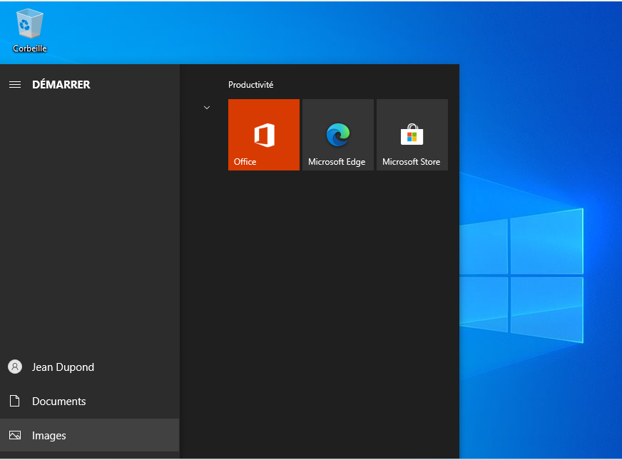
*Ouverture de session réussie pour l'utilisateur standard Jean Dupond.*

---

## 🔐 Étape 6 : Sécurisation Centralisée par GPO (Stratégies de Groupe)

Dernière brique essentielle de mon acquisition de compétences : la sécurité. J'ai créé un Objet de Stratégie de Groupe (**GPO**) nommé `GPO_Restriction_Direction` lié spécifiquement à l'Unité d'Organisation `Direction`.

La règle configurée est : *Interdire l'accès au Panneau de configuration et aux paramètres du PC*.

Après avoir appliqué un rafraîchissement des politiques sur le poste client via la commande `gpupdate /force`, la restriction est devenue immédiatement fonctionnelle sur la session d'**Alice Martin**.

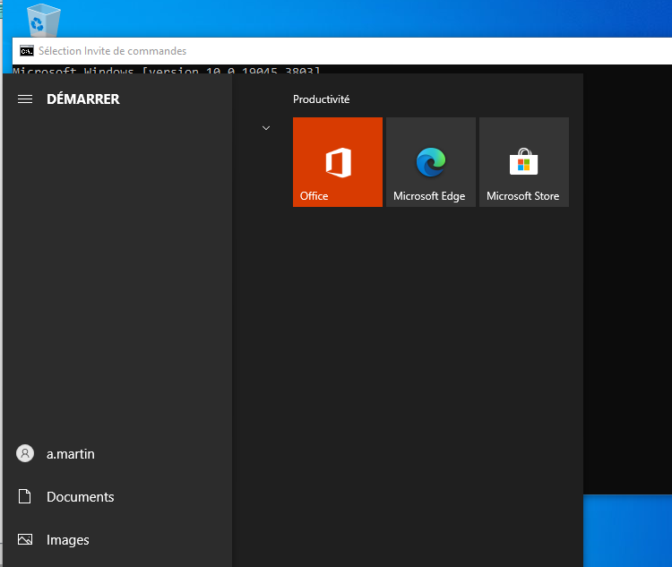
*Session de test ouverte pour Alice Martin (OU Direction).*

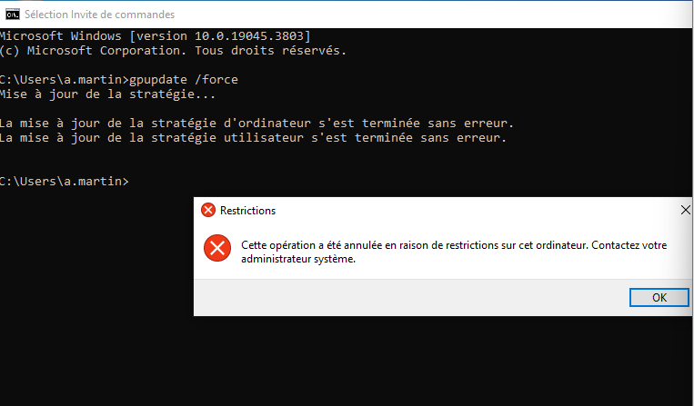
*Preuve du blocage de sécurité : l'accès aux paramètres est totalement interdit par le serveur.*

---

## 📈 Compétences Acquises & Conclusions

Ce projet personnel m'a permis de valider des compétences solides et concrètes en informatique de gestion :
1. **Maîtrise de la virtualisation :** Gestion fine des ressources, des générations de VM et de l'isolement réseau via Hyper-V.
2. **Administration d'un annuaire d'entreprise :** Compréhension de la logique d'Active Directory, de la structuration en OU et de la gestion du cycle de vie des identités.
3. **Services Réseaux essentiels :** Configuration de l'interaction critique entre le DNS (résolution de noms) et le DHCP (configuration dynamique).
4. **Automatisation (DevOps/SysAdmin) :** Utilisation de PowerShell pour industrialiser des tâches administratives répétitives.
5. **Gouvernance de la sécurité :** Déploiement et ciblage de GPO pour restreindre la surface d'attaque sur les parcs informatiques.
