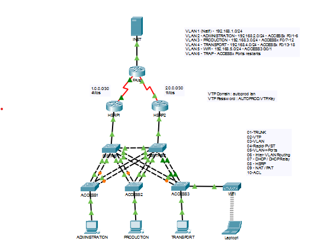

# 🔀 Projet Académique – LAN Design Cisco (Packet Tracer)

## 📋 Présentation du projet
Ce projet réalisé en mars 2026 dans le cadre de ma formation à l'IPSSI consistait à concevoir et valider une architecture réseau LAN résiliente, performante et hautement disponible en utilisant l'outil de simulation Cisco Packet Tracer.

## 🖼️ Topologie Réseau

## 🛠️ Réalisations techniques
* **Design hiérarchique :** Conception d'une architecture réseau selon le modèle à 2 niveaux (**Access / Distribution**).
* **Segmentation & Commutation :** Mise en place et configuration de **VLANs** thématiques (Administration, Production, Transport, Wi-Fi), configuration de **Trunks**, et implémentation des protocoles **VTP** (VLAN Trunking Protocol) et **RSTP** (Rapid Spanning Tree).
* **Haute Disponibilité :** Implémentation du routage inter-VLAN sécurisé et redondant avec le protocole de premier saut **HSRP** (Hot Standby Router Protocol).
* **Services Réseau & Sécurité :** Déploiement des services **DHCP**, translation d'adresses **NAT/PAT**, segmentation des flux et validation complète de la connectivité.

## 📁 Livrables du projet
* 📥 **[Télécharger le fichier de topologie Packet Tracer (.pkt)](./LAN%20Design%20(NNONNANG%20Tiphanie)%201.pkt)**
