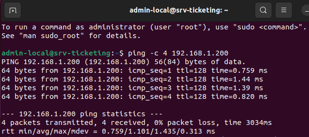
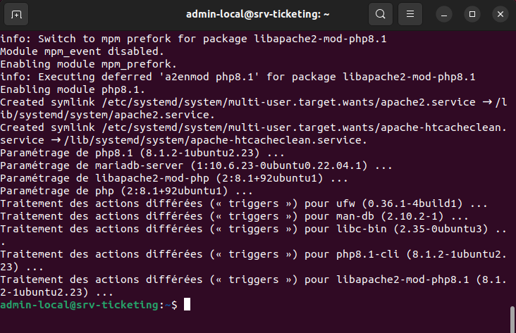
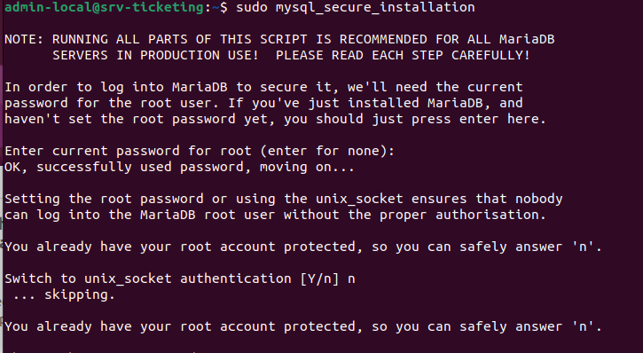
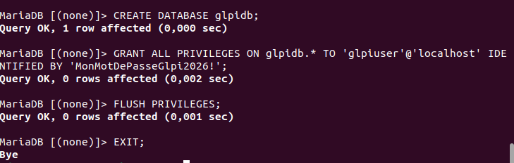
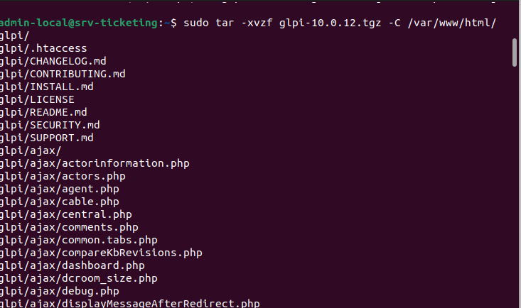
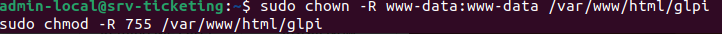
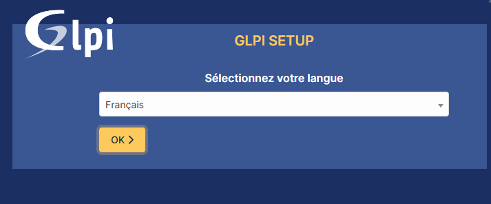
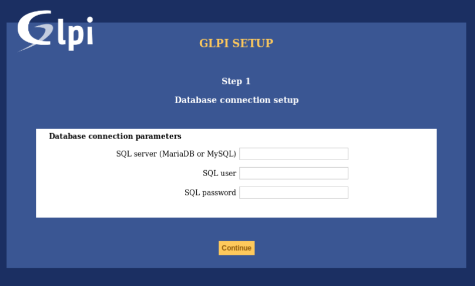
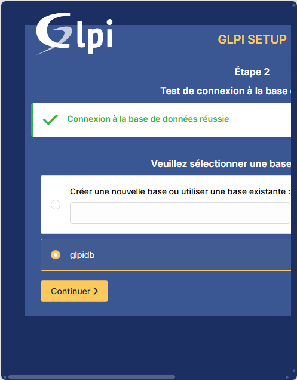
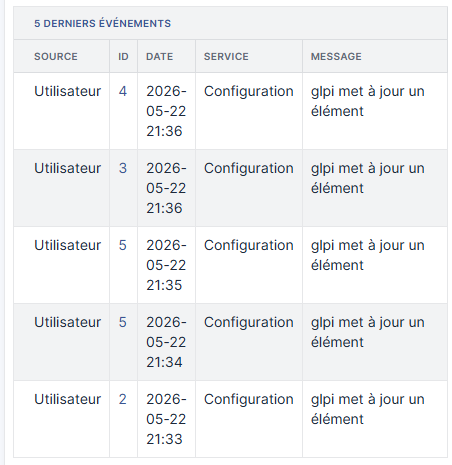

# 🎫 Déploiement, Configuration et Sécurisation d'une Plateforme de Service Desk (Ticketing) : GLPI

## 📝 Présentation du Projet
Dans le cadre de ma formation en Administration Systèmes, Réseaux et Sécurité, j'ai réalisé la mise en production complète et le durcissement d'une plateforme de **Service Desk (Ticketing)** basée sur la solution Open Source **GLPI (Gestionnaire Libre de Parc Informatique)**.

L'objectif de cette mission est de fournir à une infrastructure d'entreprise un point de contact unique pour la gestion des incidents et des demandes d'assistance, structuré selon les bonnes pratiques du référentiel ITIL. Cette solution permet de centraliser les demandes des utilisateurs, d'optimiser le temps de traitement des techniciens et d'assurer un suivi rigoureux du parc informatique.

### 🛠️ Spécifications de l'Environnement Technique
Pour garantir l'isolation et la stabilité des services, l'infrastructure s'appuie sur la pile technologique suivante :
* **Hyperviseur :** Microsoft Hyper-V (Hébergement de la machine virtuelle sur un commutateur interne isolé).
* **Système d'Exploitation :** Linux Ubuntu Server 22.04 LTS.
* **Serveur Web :** Apache2.
* **Gestionnaire de Base de Données :** MariaDB (Fork open-source de MySQL).
* **Environnement d'Exécution :** PHP 8.1 avec l'ensemble des modules requis pour GLPI.

---

## 💻 Étape 1 : Interconnexion Réseau et Validation IP

La première phase absolue avant d'installer le moindre composant applicatif consiste à valider la connectivité réseau de notre serveur Linux Ubuntu. Cette étape permet de s'assurer que la machine virtuelle communique correctement à travers le commutateur virtuel de l'hyperviseur et qu'elle peut joindre sa passerelle réseau.

Pour ce faire, j'ai exécuté un test d'interconnexion à l'aide de la commande `ping` vers l'adresse IP cible de la passerelle de l'infrastructure (`192.168.1.200`).

*Validation de la connectivité réseau avec 0% de perte de paquets lors du test de ping.*

---

## 💻 Étape 2 : Installation de l'Environnement Serveur LAMP

Une fois la connectivité réseau validée, l'étape suivante consiste à préparer le serveur à recevoir l'application GLPI. Pour cela, j'ai déployé l'environnement indispensable **LAMP** (Linux, Apache2, MariaDB, PHP). 

Cette phase installe le serveur Web chargé de distribuer les pages, le moteur de base de données relationnelle ainsi que PHP 8.1 avec les extensions applicatives requises pour le traitement des scripts.

 

 

*Suivi de la fin du processus d'installation des paquets et bascule automatique vers le module Apache mpm_prefork.*

---

## 💻 Étape 3 : Sécurisation Initiale du Système MariaDB

Une fois la pile LAMP opérationnelle, la sécurité du système de gestion de base de données devient prioritaire. Pour interdire tout accès non autorisé à notre serveur SQL, j'ai exécuté le script officiel de durcissement de MariaDB.

Cette manipulation essentielle permet de verrouiller l'accès au compte administrateur `root`, de supprimer les utilisateurs anonymes créés par défaut pour les tests, et de bloquer les connexions distantes non authentifiées.

 

 

*Exécution de la commande de sécurité et désactivation de l'authentification par socket UNIX pour privilégier un mot de passe fort.*

---

## 💻 Étape 4 : Création et Configuration de la Base de Données Dédiée

Pour que GLPI puisse stocker ses données (tickets, utilisateurs, inventaire), il lui faut un espace dédié dans notre système MariaDB. Je me suis connecté à l'interface en ligne de commande SQL pour initialiser cet environnement de manière sécurisée.

Au cours de cette étape, j'ai réalisé trois actions fondamentales :
1. Création d'une base de données vide nommée `glpidb`.
2. Création d'un utilisateur système `glpiuser` local, isolé et protégé par un mot de passe fort (`MonMotDePasseGlpi2026!`).
3. Attribution de privilèges totaux à cet utilisateur uniquement sur sa base dédiée, appliquant ainsi le principe de moindre privilège.

 

 

*Création réussie de la base de données relationnelle et application immédiate des nouveaux privilèges utilisateur.*

---

## 💻 Étape 5 : Téléchargement et Extraction de l'Archive GLPI

La base de données étant prête, l'étape suivante consiste à récupérer les fichiers sources de l'application. Pour ce projet, j'ai téléchargé l'archive officielle de la version stable **GLPI 10.0.12**.

J'ai ensuite procédé à l'extraction de l'archive compressée directement dans le répertoire racine du serveur Web Apache (`/var/www/html/`). Cette opération déploie l'arborescence complète de l'application (fichiers de configuration, scripts PHP, modules Ajax) indispensable à l'exécution de la plateforme de ticketing.

 

 

*Processus d'extraction en ligne de commande de l'ensemble des fichiers applicatifs de GLPI vers le dossier de destination du serveur Web.*

---

## 💻 Étape 6 : Configuration des Droits d'Accès et des Permissions Systèmes

Une fois les dossiers applicatifs extraits, il est impératif de configurer correctement les permissions de sécurité sur le système de fichiers Linux. Par défaut, les fichiers appartiennent à l'utilisateur ayant extrait l'archive, ce qui bloque l'exécution des scripts par le serveur Web Apache.

Pour résoudre ce problème de manière sécurisée, j'ai appliqué deux commandes majeures :
1. `chown -R www-data:www-data` : Transfère la propriété exclusive de l'intégralité du dossier GLPI à l'utilisateur système `www-data` (le compte sous lequel tourne le service Apache2).
2. `chmod -R 755` : Restreint les droits d'accès. Le serveur Web obtient les droits de lecture, écriture et exécution nécessaires pour modifier les configurations et téléverser des pièces jointes, tandis que les autres utilisateurs système ne disposent que d'un accès en lecture seule.

 

 

*Application des commandes d'attribution de propriété et de restriction des droits sur le répertoire racine de GLPI.*

---

## 💻 Étape 7 : Initialisation de l'Assistant d'Installation Graphique (Web)

Une fois les configurations serveurs et les permissions Linux appliquées à la ligne de commande, le reste de la configuration s'effectue directement depuis un navigateur Web client en ciblant l'adresse IP ou le nom de domaine du serveur (`http://<IP_SERVEUR>/glpi`).

Cette première étape sur l'interface graphique permet de sélectionner la langue d'utilisation de la plateforme (Français). L'assistant exécute également un contrôle automatisé des prérequis système pour valider la mémoire allouée et la présence de toutes les extensions PHP nécessaires avant d'autoriser la suite de l'installation.

 

 

*Choix de la langue de l'interface et lancement officiel du script d'initialisation de GLPI Setup.*

---

## 💻 Étape 8 : Connexion de l'Application à la Base de Données MariaDB

Cette étape permet de relier l'interface applicative de GLPI au moteur de base de données configuré à l'étape 4. L'assistant web demande les informations de connexion pour initialiser les tables de l'annuaire et du parc informatique.

Pour établir cette liaison de manière sécurisée, j'ai renseigné les paramètres suivants :
* **Serveur SQL :** `localhost` (indiquant que la base tourne sur la même machine virtuelle).
* **Utilisateur SQL :** `glpiuser` (le compte dédié créé précédemment).
* **Mot de passe SQL :** Le mot de passe fort associé à ce compte.

 

 

*Saisie des identifiants d'accès SQL locaux pour initier la phase de liaison applicative.*

---

## 💻 Étape 9 : Sélection de la Base de Données Cible

Une fois la connexion réseau validée avec le serveur SQL, l'assistant liste les bases de données accessibles avec les identifiants fournis. L'objectif est d'indiquer à GLPI où instancier ses tables applicatives.

Parmi les choix proposés, j'ai sélectionné la base de données `glpidb` que j'avais créée manuellement à l'étape 4. Cette méthode permet de s'assurer du bon cloisonnement des données et d'éviter que l'assistant n'essaie de créer une base avec des droits génériques.

 

 

*Sélection de la base de données dédiée glpidb pour l'initialisation du schéma applicatif.*

---

## 💻 Étape 10 : Initialisation Réussie et Validation des Tables SQL

Après avoir sélectionné la base de données, l'assistant d'installation lance l'exécution des scripts SQL pour générer l'ensemble des tables (plus de 300 tables nécessaires au fonctionnement du parc informatique, des tickets, des contrats et des utilisateurs).

Cette étape confirme la réussite de l'opération en affichant un message de succès. Elle valide que l'utilisateur `glpiuser` possède bien les droits d'écriture requis et que la structure relationnelle est prête à accueillir les premières données de production.

 

 

*Notification de l'assistant confirmant la création complète de la structure de l'annuaire de la base de données.*

---

## 💻 Étape 11 : Fin de l'Installation et Restitution des Identifiants par Défaut

Cette dernière étape de l'assistant confirme la fin de la configuration de notre plateforme Service Desk. L'outil génère automatiquement les comptes d'accès par défaut pour permettre à l'administrateur de se connecter pour la première fois.

L'assistant affiche une matrice de quatre comptes d'usine configurés pour différents profils de l'entreprise (Admin, Technicien, Normal, Post-Only). Le compte le plus critique est `glpi/glpi`, qui dispose des privilèges super-administrateur sur l'ensemble de l'infrastructure.

 

 

*Affichage de la liste des comptes par défaut créés par le système pour la première phase de connexion.*

---

## 💻 Étape 12 : Première Connexion et Authentification Super-Administrateur

L'installation étant finalisée, j'ai procédé à la première phase d'authentification sur la plateforme en utilisant le compte super-administrateur d'usine (`glpi/glpi`). Cette action permet de valider le bon fonctionnement du moteur d'authentification interne et d'accéder au tableau de bord centralisé de l'application.

Dès la connexion réussie, on arrive sur l'interface principale de gestion. Le système affiche immédiatement un bandeau d'alerte orange très important concernant la sécurité. Ce message nous indique que deux actions de durcissement critiques doivent être menées pour sécuriser l'environnement de production : modifier les mots de passe d'usine et supprimer le fichier d'installation du serveur Linux.

 

 

*Accès initial au panneau de contrôle de GLPI et affichage des alertes de sécurité prioritaires.*

---

## 💻 Étape 13 : Actions de Post-Installation et Sécurisation Finale du Serveur

Pour finaliser proprement ce projet et passer le serveur en mode de production sécurisé, j'ai traité les deux alertes critiques remontées par le tableau de bord lors de la première connexion.

Ces actions de durcissement indispensables comprennent :
1. **Suppression du script d'installation (`install.php`) :** En ligne de commande sur le serveur Linux, j'ai supprimé définitivement ce fichier du répertoire Web. Cela empêche qu'un utilisateur malveillant ne tente de réinitialiser la base de données à distance.
2. **Modification des mots de passe d'usine :** J'ai modifié le mot de passe du compte `glpi` ainsi que des trois autres comptes génériques (`tech`, `normal`, `post-only`) pour y appliquer notre politique interne de mots de passe forts.

 

 

*Disparition complète des bandeaux d'alerte orange après suppression du fichier d'installation et modification des accès d'usine.*

---
